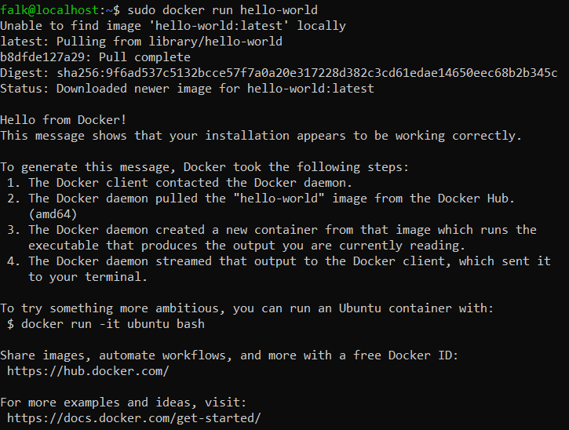

# Install and run Docker on Ubuntu
## Install Docker
Use `apt` to install the `docker.io` package:
```bash
sudo apt install docker.io
```

Start docker and enable it to start after the system reboot:
```bash
sudo systemctl enable --now docker
```

Optionally give any user administrative privileges to docker:
```bash
sudo usermod -aG docker SOMEUSERNAME
```

## Run Docker
Run the `hello-world` container to test successful docker installation:
```bash
docker run hello-world
```


