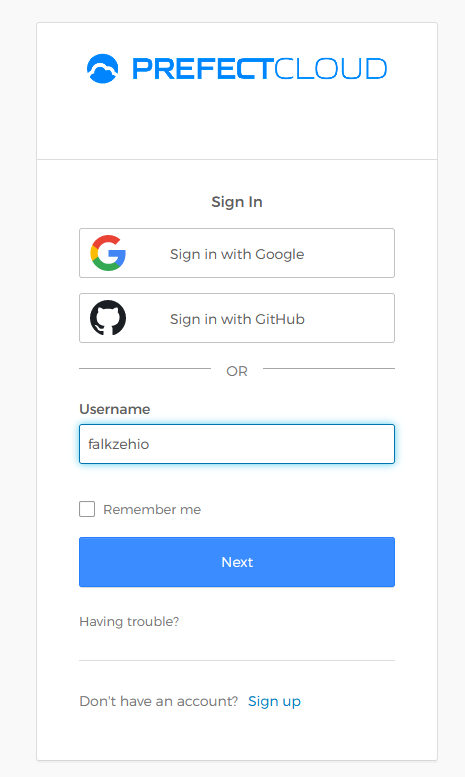
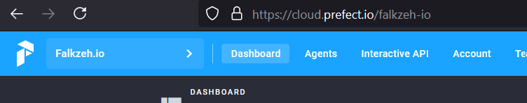
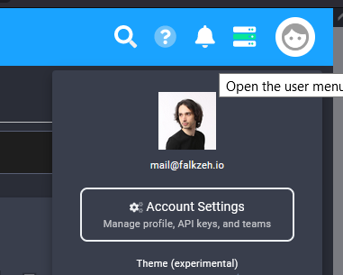
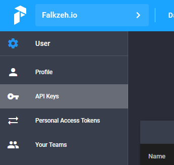
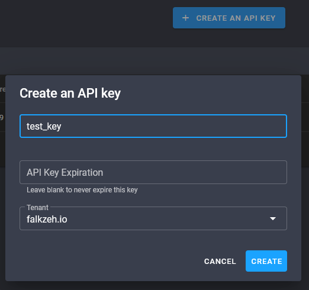
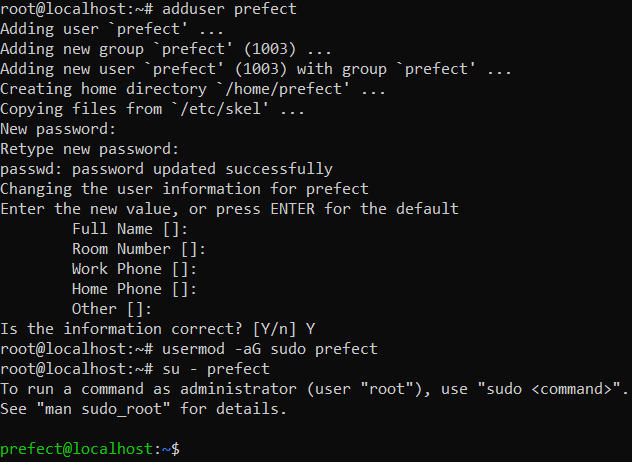
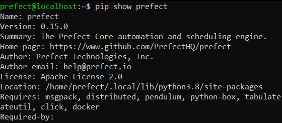
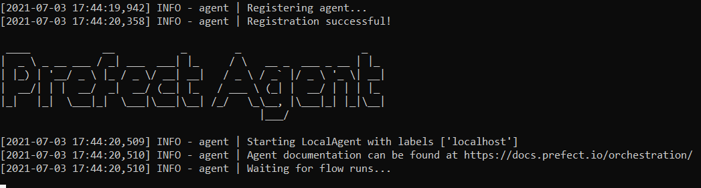

# Create and run a Prefect Agent on Ubuntu
## Creating a Prefect Account
Go to [cloud.prefect.io](https://cloud.prefect.io/), follow the signup process and go to "Dashboard".




## Creating an API Key
While logged in click on your user icon in the upper right corner, go to `Account Settings` and `API Keys`.




There you will be able to create a new API Key by clicking on `CREATE AN API KEY`, giving it a name and setting an optional expiration date.



We will need this Key in just a moment - save it somewhere safe for now!

## Installing Prefect on Ubuntu
In this case we will install and run prefect on Ubuntu 20.04.
Log in to your server as root:
```bash
ssh root@server_ip_address
```

Create a new superuser:
```bash
adduser prefect
usermod -aG sudo prefect
```

Switch to your new user:
```bash
su - prefect
```



Install Prefect via Pip:
```bash
pip3 install prefect
```

You can check if the installation was successful with:
```bash
pip3 show prefect
```



## Login
Using the API Key we created earlier we can now log in:
```bash
prefect auth login --key <your api key>
```
Start the Prefect Agent:
```bash
prefect agent local start
```



The Prefect Agent will now wait to receive Flows to run. If you'd like to start the Agent for a specific label use:
Start the Prefect Agent:
```bash
prefect agent local start -l <your label>
```
